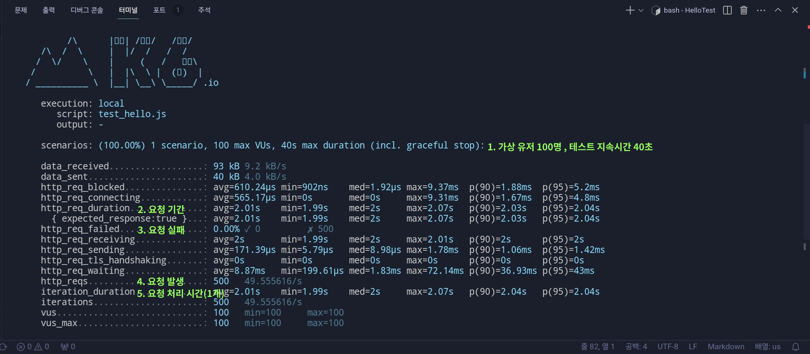

## 테스트 프로그램 및 도구 사용하기 

### 여러가지 방식으로 테스트 하기 
#### curl (테스트 프로그램) 
다양한 방식의 요청(POST,DELETE,PUT)을 테스트할 수 있습니다 
> 맥OS,리눅스는 운영체제에 내장되어 있어 명령어를 통해 사용 가능합니다

1. hello.js 실행 
2. 터미널 실행후 curl (ip):(port) -> localhost:8000 명령어 입력

### 동시에 요청을 처리하는지 성능 테스트 하기 <hr>
실제 운영 되고 있는 서버와 학습용 서버와 가장 큰 차이로 트래픽이 있습니다 <br>
내가 만든 서버가 어느정도 성능을 보여주는지 파악하기 위해서는 그에 맞는 유저와 트래픽에 장애가 발생하지 않는지 테스트 하는게 좋은 방법입니다 <br>

학습용으로 만든 서버에 실제 유저를 통해서 테스트 하기에는 어려움이 있습니다 <br>
그래서 가상으로 만든 유저의 트래픽을 설정하여 테스트하는 도구를 사용합니다 

자바스크립트 문법으로 성능 테스트가 가능한 K6을 사용합니다 

#### <a href="https://k6.io/docs/get-started/installation/">`K6 설치 `</a>
`제목을 누르면 설치 방법이 나옵니다`
> 각 운영체제 별로 설치 방법이 다릅니다 여기서는 리눅스를 기반으로 합니다 

순서대로 밑에 있는 명령어를 실행하여 설치 합니다 
```
sudo gpg -k

sudo gpg --no-default-keyring --keyring /usr/share/keyrings/k6-archive-keyring.gpg --keyserver hkp://keyserver.ubuntu.com:80 --recv-keys C5AD17C747E3415A3642D57D77C6C491D6AC1D69

echo "deb [signed-by=/usr/share/keyrings/k6-archive-keyring.gpg] https://dl.k6.io/deb stable main" | sudo tee /etc/apt/sources.list.d/k6.list 

sudo apt-get update 

sudo apt-get install k6 
``` 
> K6 설치 확인 하기 

다음 명령어를 통해 K6 버전을 확입합니다 `ex) k6 v0.49.0`

#### K6 도구로 성능 테스트 하기 

1. 테스트 스크립트 작성  
> 먼저 hello.js를 테스트 하기 위해 테스트 코드를 작성합니다 

`test_hello.js`
``` 
import http from "k6/http";

export const options = {               // test option 
    vus: 100,                          // virtual user
    duration: "10s",                   // test time (ms)
};

export default function() {
    http.get("http://localhost:8000"); // test function 
} 
```
- ```import http from "k6/http";``` <br>
k6에서 제공하는 내장 모듈 http를 가져와 HTTP 요청을 보내거나 응답 받는데 사용됩니다 

- ```export const options = {...};```<br>
K6 성능 테스트 코드에서 사용되는 옵션 객체 <br>
`'export' JS의 모듈 시스템에서 사용되며 변수,함수,클래스,객체를 다른 파일에서 사용 가능하도록 내보내는 역활`

- ```vus/duration```
   - vus: 가상 사용자 수
   - duration: 테스트 지속 시간 
- ```export default function() {...}```<br>
function 함수를 외부 파일에 내보낼수 있는 함수 

- ```http.get("http://localhost:8000");```<br>
K6 성능 테스트 코에서 사용된는 함수로 HTTP의 GET 요청을 보냄 <br> 
보내는 곳 URL을 인자값으로 넘겨준다 

2. 테스트 진행 <br>
- 먼저 테스트를 진행할 서버를 실행합니다 (hello.js)
- 터미널에 k6 run test_hello.js(테스트 스크립트 파일) 명령어를 입력하고 실행합니다 

 </img>

실행 하면 다음과 같은 콘솔창이 나오게 됩니다 

1. 테스트 실행 환경을 나타냅니다 <br>
options 객체에 설정한 가상 유저수 와 테스트 지속시간을 알려줍니다 
테스트 스크립트에서 유동적으로 변경하여 테스트를 할 수 있습니다  

2. 요청 기간을 나타냅니다 <br>
HTTP 요청이 걸린시간을 의미합니다 평균 2.01s <br>
`p(90)=2.03s는 90%의 요청이 2.03초 이하`3

3. 요청에 대한 실패율을 나타냅니다

4. 총 요청 회수를 나타냅니다 <br>
100명의 유저가 10초 동안 보낸 총 요청 횟수입니다 대략 2초 간격으로 보냄 

5. 요청이 완료되고 다시 시작 될때까지 걸리는 시간을 나타냅니다  <br>
평균 2.01초가 걸렸음 


